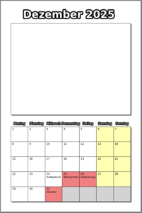

# Calendar Generator
This script can be used to generate a calendar pdf with one A4 page per month.
Each page has half the page empty so you can add photo or your kids can draw something:

[](calendar.png)

To use it, simply call the script and add the year as a parameter:
```bash
python calendar_generator.py --year 2025
```

# Copyright
The initial script to generate a months page was written by [Peter Wilson](https://github.com/meta4) and can be found [here](https://github.com/meta4/mplcal).

I ([George Ruinelli](https://github.com/caco3)) extended it to add the photo section and generate a full calendar.

# Notes 